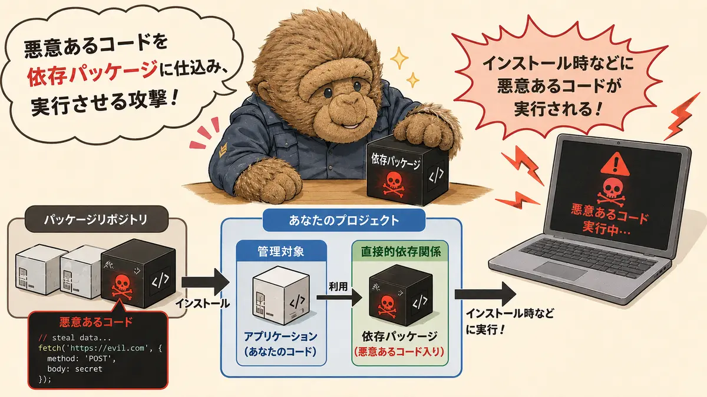

# サプライチェーン攻撃対策と<br>pnpmのススメ

<span class="text-dimmed">
2026/05/17   Tadashi Aikawa
</span>

---
title: Agenda
layout: chapter-divider
---

---
title: Chapter1
layout: chapter-divider
activeChapter: 1
---

---

# サプライチェーン攻撃とは

悪意あるコードを **依存パッケージ** に仕込み、実行させる攻撃

{class="mx-auto w-80% mt-6"}

---

# 本日のスコープ

1. 攻撃者によって悪意のあるパッケージが公開される
2. 悪意のあるパッケージをインストールする
3. 悪意のあるコードが実行される
4. 被害を拡大させないためリカバリーする

---

# 本日のスコープ

1. ~~攻撃者によって悪意のあるパッケージが公開される{class="text-gray"}~~
2. 悪意のあるパッケージをインストールする
3. 悪意のあるコードが実行される
4. ~~被害を拡大させないためリカバリーする{class="text-gray"}~~

---

# パッケージマネージャー

ソフトウェアの依存パッケージを管理するツール全般のこと。

<showcase sizeClass="size-48" gapClass="gap-4" class="mt-16 gap-16" :sources="[
  { name: 'npm', url: 'https://cdn.svglogos.dev/logos/npm.svg' },
  { name: 'pnpm', url: 'https://cdn.svglogos.dev/logos/pnpm.svg' },
  { name: 'Deno', url: 'https://cdn.svglogos.dev/logos/deno.svg' },
  { name: 'Bun', url: 'https://cdn.svglogos.dev/logos/bun.svg' },
]" />

---

# セマンティックバージョニング

後方互換性や機能追加の有無を考慮したバージョンインクリメントルールの1つ。

- `MAJOR.MINOR.PATCH` と表現する
  - 例: `1.2.11`

| 後方互換性 | 機能追加 | 上げるバージョン | `1.2.11` から上げるなら？ |
| ---------- | -------- | ---------------- | ------------------------- |
| **ない**   |          | MAJOR            | `2.0.0`                   |
| ある       | **ある** | MINOR            | `1.3.0`                   |
| ある       | ない     | PATCH            | `1.2.12`                  |

<refer>

[Semantic Versioning 2.0.0 | Semantic Versioning](https://semver.org/)

</refer>

---

# ロックファイル

依存パッケージの**正確**なバージョンを記録したファイル。

| パッケージマネージャー | ロックファイル名    |
| ---------------------- | ------------------- |
| npm                    | `package-lock.json` |
| pnpm                   | `pnpm-lock.yaml`    |
| Deno                   | `deno.lock`         |
| Bun                    | `bun.lock`          |

---
title: Chapter2
layout: chapter-divider
activeChapter: 2
---

---
layout: fact
---

# 大事なこと

---
layout: image
image: ./attachments/etokichi-guards5.webp
backgroundSize: cover
backgroundPosition: left top
---

# サプライチェーン攻撃には『複数』の対策が必要です。{class="text-white! text-center"}

# それにより、1つの障壁が突破されても被害に至らず済みます。{class="pt-128 text-white! text-center"}

---
layout: image
image: ./attachments/002.webp
backgroundSize: cover
backgroundPosition: left top
---

<div v-click.fade-in class="spotlight left-40 top-96 w-112 h-72"></div>

<div v-click.fade-in>

{class="absolute size-64 left-52 bottom-16"}

<div class="absolute top-48 left-9% w-82% bg-white! px-12 py-8">

## 悪意のあるパッケージのインストールをどう防ぐか？

</div>

</div>

---
layout: fact
---

<h1>

{class="size-24 inline mb-2"}
対策1

</h1>

インストールする直接依存パッケージのバージョンを固定する

---

# npmのデフォルト設定では バージョンのprefixに `^` がつく

```json [package.json]
{
  "dependencies": {
    "direct-package": "^1.2.11"
  }
}
```

<v-click>

`^1.2.11` の意味:

『**MAJORバージョン** が上がらない範囲で `1.2.11` _以上_ の最新バージョン』

</v-click>

---
layout: fact
---

**同じ `package.json`** でも

**『インストールのタイミング』**や**『node_modulesの状態』** が異なれば

_インストールされるパッケージバージョンは異なることがある_

<conclusion overlay>

*新しくリリースされた悪意のあるパッケージ*を<br/>
*知らない間にインストールしてしまう*恐れがある

</conclusion>

---

# exactバージョンを指定する

```json [package.json]
{
  "dependencies": {
    "direct-package": "1.2.11"
  }
}
```

<v-click>

パッケージごとの設定方法

::code-group

```sh [npm]
npm config set save-exact=true
# ~/.npmrc に save-exact=true が追加される
```

```sh [pnpm]
pnpm config set save-exact true
# ~/Library/Preferences/pnpm/config.yaml に追加される
```

```toml [Bun (bunfig.toml)]
# npmの設定がされていれば不要。それ以外は:
[install]
exact = true
```

```sh [Deno]
# 設定はできない。コマンドごとに --save-exact を指定する
deno add --save-exact <package>
```

::

</v-click>

---
layout: fact
---

<h1>

{class="size-24 inline mb-2"}
対策2

</h1>

インストールする推移的依存パッケージのバージョンを固定する

---

# 『直接依存』と『推移的依存』

```bash
my-project
└─┬ direct-package: "1.2.11"           <--- 『直接依存』
  └── transitive-package: "^1.11.19"   <--- 『推移的依存』
```

<v-click>

なので『対策1』をしても

```bash
my-project
└─┬ direct-package: "1.2.11"           <--- 『直接依存』はexactになるけど
  └── transitive-package: "^1.11.19"   <--- 『推移的依存』はexactにならない
```

</v-click>

---

# ロックファイルを使う

<div v-click.fade-in class="absolute text-[75%] right-8 top-12 shadow-lg z-50">

```bash
my-project
└─┬ direct-package: "1.2.11"           <--- 『直接依存』
  └── transitive-package: "^1.11.19"   <--- 『推移的依存』
```

</div>

```json [package-lock.json] {*|2,5,6-10|5,17-25|5,11-16}{maxHeight:'90%', lines: true}
{
  "name": "my-project",
  "lockfileVersion": 3,
  "requires": true,
  "packages": {
    "": {
      "dependencies": {
        "direct-package": "1.2.11"
      }
    },
    "node_modules/transitive-package": {
      "version": "1.11.20",
      "resolved": "https://registry.npmjs.org/transitive-package/-/transitive-package-1.11.20.tgz",
      "integrity": "sha512-YbwwqR/uYpeoP4pu043q+LTDLFBLApUP6VxRihdfNTqu4ubqMlGDLd6ErXhEgsyvY0K6nCs7nggYumAN+9uEuQ==",
      "license": "MIT"
    },
    "node_modules/direct-package": {
      "version": "1.2.11",
      "resolved": "https://registry.npmjs.org/direct-package/-/direct-package-1.2.11.tgz",
      "integrity": "sha512-fjQDTJ57YeVD+Ko9WIssjKAsi2o8sFR381WMVhObc64uiDYwamf6OPj+MofaSXf1CmVk+h88nG9agR1tYOKkyw==",
      "license": "MIT",
      "dependencies": {
        "transitive-package": "^1.11.19"
      }
    }
  }
}
```

---

# ロックファイルのパッケージバージョンを厳守するコマンド

::code-group

```sh [npm]
npm ci
```

```sh [pnpm]
# pnpm >= v11 の場合
pnpm ci

# pnpm < v11 の場合
pnpm i --frozen-lockfile
```

```sh [Bun]
bun ci
```

```sh [Deno]
deno install --frozen
```

::

<div v-click class="mt-12">

通常のインストールコマンド (`npm i` など) を使うシーンは依然としてあります。

- 新しいパッケージをインストールする
- 既存パッケージをバージョンアップする

</div>

---
layout: center
---

<Bubble image="./attachments/etokichi-shy.webp" imageHeight="140" imageGap="32px">

そのときは*ロックファイルだけでは防げない*んでしょ？

</Bubble>

<Bubble v-click image="./public/attachments/etokichi+1.webp" position="right" imageHeight="220">

安心して！<br/>
インストールのリスクを減らす方法があるんだよ！

</Bubble>

---
layout: fact
---

<h1>

{class="size-24 inline mb-2"}
対策3

</h1>

リリースされて間もないパッケージをインストールさせない

---

# リリースされてからインストール可能になるまでの時間を設定

::code-group

```sh [npm]
npm config set min-release-age 1 # 日設定
# npm >= v11.10 の場合のみ
```

```sh [pnpm]
pnpm config set minimumReleaseAge 1440 # 分設定
# pnpm >= v11 の場合は設定しなくてもデフォルトで1440になっている
```

```toml [Bun]
# bunfig.toml に以下の設定を追加
[install]
minimumReleaseAge = 86400 # 秒設定
```

```json [Deno]
// deno.json に以下を設定
{
  "minimumDependencyAge": 1440 // 分設定
}
```

::

<v-clicks class="mt-8">

- 著名なパッケージは24時間以内に問題が発覚・対処されることが少なくない
  - 『1日』に設定しておけば防げる可能性が上がる
- ただ、最近はステルス性の高いサプライチェーン攻撃も増えてきた
  - 発覚に数日かかるケースもあるので『3日』、安全に倒すなら『7日』でもいいかも
- 個人的には『1日』で様子見
  - pnpmでデフォルトが『1日』なので

</v-clicks>

---
layout: center
---

<Bubble image="./public/attachments/etokichi-shy.webp" imageHeight="140" imageGap="32px">

大事をとって **7日** に設定したとしても<br/>
_7日以上見つからない攻撃_ を受けたらもう終わりなの？？

</Bubble>

<Bubble v-click image="./public/attachments/etokichi+1.webp" position="right" imageHeight="220">

安心して！<br/>
インストールされただけならまだ手は打てるんだよ！

</Bubble>

---
layout: image
image: ./attachments/002.webp
backgroundSize: cover
backgroundPosition: left top
---

<div v-motion class="spotlight"
  :enter="{ x: '6rem', y: '22rem', width: '28rem', height: '18rem' }"
  :click-1="{x: '34rem', y: '12rem', width: '40rem', height: '30rem'}"
></div>

<div v-click.fade-in="2">

{class="absolute size-64 left-192 bottom-16"}

<div class="absolute top-48 left-16% w-68% bg-white! px-12 py-8">

## 悪意のあるコードの実行をどう防ぐか？

</div>

</div>

---
layout: fact
---

<h1>

{class="size-24 inline mb-2"}
対策4

</h1>

ライフサイクルスクリプトを実行させない

---

# ライフサイクルスクリプトとは

`install` などのライフサイクルイベントに紐づく `scripts` のプロパティ。

```json [package.json]
{
  "scripts": {
    "preinstall": "echo 'installの直前に実行される'",
    "postinstall": "echo 'installの直後に実行される'"
  }
}
```

<div class="h-4"></div>

`<event>` に対し、それぞれのタイミングで実行される。

- `pre<event>` で `<event>` の直前
- `post<event>` で `<event>` の直後

<refer>

[docs.npmjs.com/cli/v11/using-npm/scripts](https://docs.npmjs.com/cli/v11/using-npm/scripts)

</refer>

---

# ライフサイクルスクリプトを使った*悪意のあるコード*実行例

```json [direct-package または transitive-package の package.json]
{
  "scripts": {
    // postinstallの利用は代表的な手口
    "postinstall": "node 認証情報を抜き取って外部に送信するコード"
  }
}
```

<div v-click class="mt-8">

_インストールが完了した時点_ で攻撃成功となる。

```console
cd my-project
npm i
```

</div>

---

# ライフサイクルスクリプトを無効化する設定

::code-group

```sh [npm]
npm config set ignore-scripts true
```

```sh [pnpm]
pnpm config set ignore-scripts true
```

```toml [Bun]
# bunfig.toml
[install]
ignoreScripts = true
# v1.2.0以上
```

```sh [Deno]
# 設定不要: デフォルトで無効のため
# 必要なパッケージは `deno approve-scripts` で明示的に許可する
```

::

<div v-click class="mt-8">

**依存パッケージの**ライフサイクルスクリプトをほぼ実行させないだけなら......

::code-group

```sh [npm]
# npmでは依存パッケージのライフサイクルスクリプトだけを無効化できない
npm config set ignore-scripts true
```

```sh [pnpm]
# v11 なら設定不要
# strictDepBuilds のデフォルトが `true` になったため、エラーで停止する
```

```toml [Bun]
# 設定不要
# default-trusted-dependencies 以外は原則無効化されているため実行されない
```

```sh [Deno]
# 設定不要: デフォルトで無効のため
# 必要なパッケージは `deno approve-scripts` で明示的に許可する
```

::

</div>

---
layout: center
---

<Bubble image="./public/attachments/etokichi-shy.webp" imageHeight="140" imageGap="32px">

ライフサイクルスクリプトを*本当に*必要としている<br/>
パッケージの処理も無効化されてしまわないの？？

</Bubble>

<Bubble v-click image="./public/attachments/etokichi+1.webp" position="right" imageHeight="220">

安心して！<br/>
設定で指定したパッケージだけ<br/>
ライフサイクルスクリプトを有効にできるんだよ！

</Bubble>

---
layout: fact
---

### くわしくはこちらのページをご覧ください

<div class="link-card-v2">
  <div class="link-card-v2-site">
    
    <span class="link-card-v2-site-name">Minerva</span>
  </div>
  <div class="link-card-v2-title">
    📕npmのセキュリティ強化設定 - Minerva
  </div>
    <div class="link-card-v2-content">
    npmレジストリへのサプライチェーン攻撃対策として、npm・pnpm・Bun・Denoでバージョン固定、ロックファイル、スクリプト無効化、minimumReleaseAgeを設定する方法を解説する。 ... 
  </div>
  
  <a href="https://minerva.mamansoft.net/Notes/%F0%9F%93%95npm%E3%81%AE%E3%82%BB%E3%82%AD%E3%83%A5%E3%83%AA%E3%83%86%E3%82%A3%E5%BC%B7%E5%8C%96%E8%A8%AD%E5%AE%9A"></a>
</div>

**『特定の推移的依存パッケージだけバージョン固定する方法』** もあります。

---
title: Chapter3
layout: chapter-divider
activeChapter: 3
---

---
layout: center
---

<Bubble image="./public/attachments/etokichi-crying.webp" imageHeight="180" imageGap="32px">

仕組みも難しいし、設定も多くてよく分からないよ〜

</Bubble>

<Bubble v-click image="./public/attachments/etokichi+1.webp" position="right" imageHeight="220">

安心して！<br/>
_pnpm_ (v11) を使えば簡単だよ！

</Bubble>

---

# pnpm v11の場合にやること `グローバル`

##### 1. 一度だけ{.mb-4.mt-8}

```
pnpm config set save-exact true
```

---

# pnpm v11の場合にやること `プロジェクト`

##### 2. パッケージインストールのとき{.mb-4.mt-8}

```
pnpm ci
```

##### 3. ライフサイクルスクリプトを実行したい依存パッケージがあるとき{.mb-4.mt-8}

```yaml [pnpm-workspace.yaml]
allowBuilds:
  hogePackage: true
```

##### 4. 特定の推移的依存パッケージバージョンを固定したいとき(脆弱性対応など){.mb-4.mt-8}

```yaml [pnpm-workspace.yaml]
overrides:
  "dayjs": "1.11.18"
```

---
layout: fact
---

# まとめ

---

# まとめ

- サプライチェーン攻撃は『インストール』と『コード実行』に対策が必要
  - 『直接依存関係』と『推移的依存関係』のバージョンは固定する
  - 『リリース間もないパッケージ』はインストールしない
  - 『ライフサイクルスクリプトの実行』は最小限に留める
- 『設定方法』はパッケージマネージャーやバージョンによって異なる
- pnpm v11 を使うと設定が楽、しかも安全
